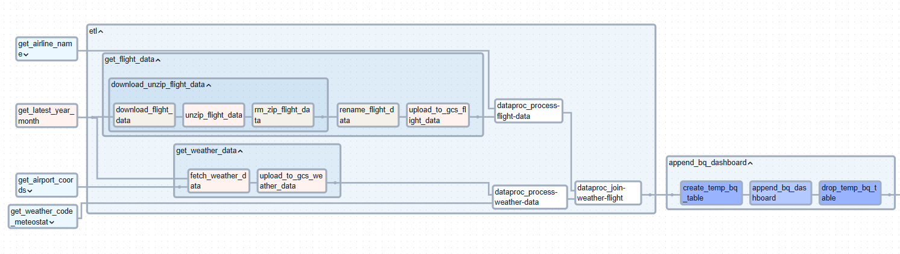
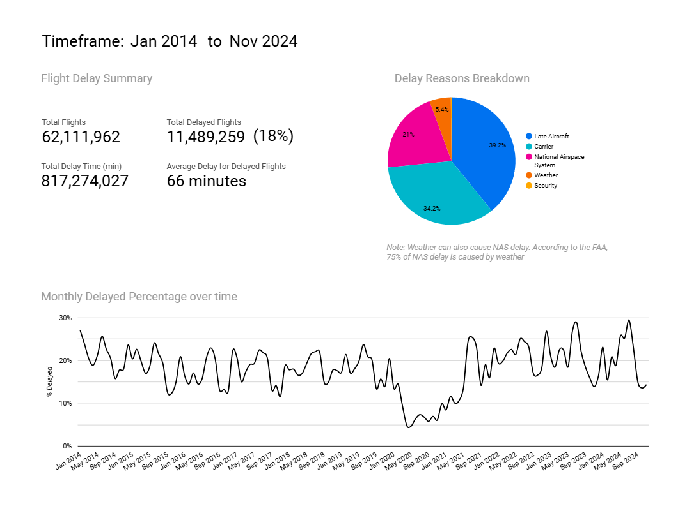
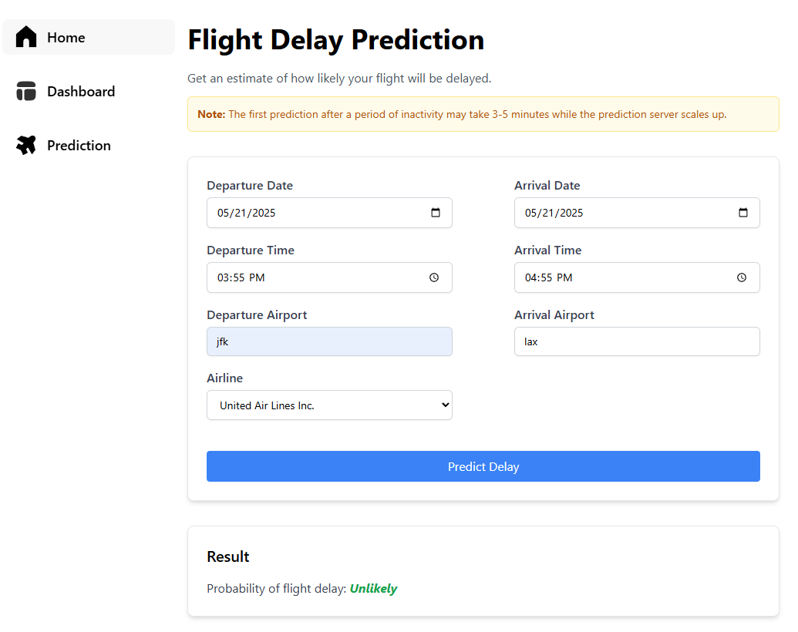

# US Flight Delay Prediction

US Flight Delay Prediction is a comprehensive data engineering and machine learning project that analyzes 60 million rows of flight data from the U.S. Department of Transportation to predict flight delays and visualize aviation trends. The system integrates historical flight records with real-time weather data to provide accurate delay predictions for upcoming flights.

This repository contains 5 main components:
1. Apache Airflow Data Pipeline: Automates monthly ingestion and transformation of flight data using Airflow DAGs. Integrates with Google Cloud Storage (GCS), BigQuery, public datasets, and external APIs.
2. Spark Processing Jobs:
    - Data processing:  Cleanses and transforms raw flight data into structured, analysis and ML-ready formats.
    - Machine Learning: Trains, evaluate, and serves flight delay prediction models entirely on Databricks.
3. Looker Dashboard: Interactive visualization of historical flight and weather data connected to BigQuery.
4. Web Application: A Next.js app with Tailwind CSS, providing an interactive interface for users to explore flight data and get real-time delay predictions. Fetches real-time weather data and prediction results via REST APIs from OpenWeatherMap and Databricks Model Serving.
5. Terraform: Manages the entire cross-cloud deployment using Infrastructure as Code, provisioning resources on both AWS and GCP.

## 1. Airflow DAG

For more details, see the [Airflow README](airflow/README.md).

## 2. Spark Processing Jobs

For more details, see the [Spark README](spark/README.md).

## 3. Looker Dashboard
Dashboard link: https://lookerstudio.google.com/reporting/87d7d9ac-c491-4c82-9906-6d95bdb7b2e0

The Looker Studio dashboard provides interactive visualizations of key trends and statistics derived from flight and weather data. It enables users to explore relationships between flight delays and various factors such as:

- Date and time patterns

- Airline and airport performance

- Weather conditions

The dashboard is connected to data in BigQuery and updates automatically as new data is ingested.

## 4. Web Application

For more details, see the [NextJS README](nextjs/README.md).

## 5. Terraform (Infrastructure as Code)

The entire infrastructure is provisioned and managed using Terraform, enabling reproducible, version-controlled deployments across both AWS and GCP.

- **Google Cloud Platform (GCP)**
  - **Cloud Storage (GCS)**: Stores raw flight data, processed datasets, and metadata used in pipelines and dashboards.
  - **BigQuery**: Serves as the centralized analytics warehouse for processed data and Looker Studio visualizations.
  - **Dataproc Serverless**: Executes Spark jobs for large-scale data processing.

- **Amazon Web Services (AWS)**
  - **EC2 Instance**: Hosts the Next.js web application.
  - **ECS Fargate + Step Functions**: Runs the monthly data pipeline in a cost-efficient, serverless manner.
  - **VPC**: Isolates resources for security. Utilize security groups to allow only necessary traffic between components.

- **IAM for AWS and GCP**: Enforces least-privilege access across services and enables secure cross-cloud communication.
