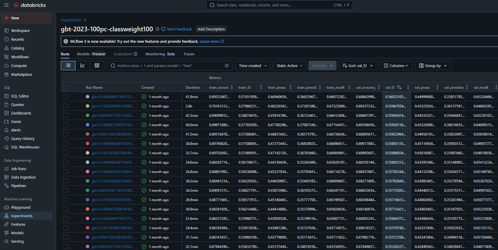

# Spark

## Spark Processing Jobs

The folder `jobs` contains the spark scripts used to transform the raw data retrived from data sources into structured datasets optimized for tasks such as Analytics and ML.

Key steps include:
- Data Cleansing: Handles missing values, enforces schema consistency, and standardizes naming conventions.
- Feature Engineering and Data Enrichment: Extracts meaningful features for existing columns and joins metadata using broadcast joins for optimal performance.
- Merges flight and weather data to create a comprehensive dataset for downstream modeling and dashboarding.

## Spark ML on Databricks
The `databricks_notebooks` folder includes notebooks used to train and evaluate flight delay prediction models on Databricks using scalable Spark ML workflows.

**Goal**: To predict whether a flight will be delayed by more than 15 minutes at departure, using features such as airline, airports, flight datetime, and weather conditions (e.g., temperature, precipitation, wind speed). The full list of features can be found in `./databricks_notebooks/features.json`.

**Model**: Gradient Boosted Trees (XGBoost)  

**Pipeline**: The pipeline consists of the following steps (details in `./databricks_notebooks/xgboosted.ipynb`):
- `SQLTransformer` to generate aggregate features from historical data 

- `Bucketizer` and `StringIndexer` to handle discretization and categorical encoding.

- Custom `TargetEncoder` to efficiently encode high-cardinality categorical features such as airport based on their mean delay rate.

- Class weighting to address class imbalance in the binary classification problem.

- `GBTClassifier` (Gradient Boosted Trees) in PySpark ML to train the final model.

**Evaluation**: The model is evaluated using the following metrics:
- Primary metrics: F2 score (to prioritize recall over precision but still maintain a balance), Area Under the Precision-Recall Curve (good for imbalanced datasets).

- Other: Accuracy, Precision, Recall

**Experiment Tracking**: All experiments are tracked with MLflow, which logs hyperparameters, metrics, and model artifacts to support comparison and selection of the best-performing model.

**Model Serving**: The final model is registered and served through **Databricks Model Serving**, making it available for real-time inference via REST API.